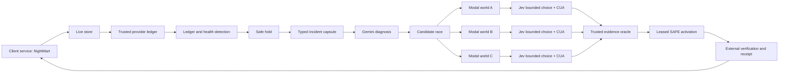

# NightWatch

<p align="center">
  <strong>Evidence-driven incident detection and verified recovery for live services</strong><br>
  Detect the failure. Contain the target. Race repairs in isolated worlds. Ship only measured recovery.
</p>

<p align="center">
  
  
  
  
  
</p>

> **Demo boundary:** NightMart is a deliberately vulnerable mock client service used to demonstrate NightWatch. It is not NightWatch itself, and it is not a production payment service. The same recovery pattern can be adapted to another client API, web application, or operational service.

## What NightWatch does

Most incident tooling stops at alerting. A single generative patch is also not enough: it may look plausible while breaking a legitimate user flow or failing to address the actual fault.

NightWatch is an evidence-first recovery pipeline:

1. Observe a trusted client signal, such as a provider-ledger inconsistency or a public HTTP 503.
2. Contain the affected route and read the containment state back.
3. Freeze a typed, hashable incident capsule.
4. Ask Gemini for a structured diagnosis and multiple repair candidates.
5. Run candidates concurrently in isolated Modal worlds.
6. Use Jev and CUA to exercise real browser interactions in each world.
7. Grade the resulting evidence with deterministic code-owned rules.
8. Activate only a validated repair, verify the external service, and write an engineer-ready receipt.

The core principle is simple:

> **Gemini explains. Jev chooses bounded browser actions. CUA performs them. Modal isolates them. The trusted oracle decides whether the evidence is sufficient.**

## The live stage demo

The current stage path is a working, scripted showcase built around a deployed NightMart live store and provider ledger:

| Stage action | What it demonstrates | Observable proof |
| --- | --- | --- |
| demo-target/1-DEMO.cmd | Arms a fresh duplicate-capture namespace and opens checkout plus dashboard | NightMart returns PAID while the provider ledger records two £79.99 captures |
| demo-target/2-CYBERSECURITY.cmd | Injects an isolated public HTTP 503 outage | Refreshing NightMart returns a protected 503 response and blocks checkout traffic |
| demo-target/3-RESET.cmd | Restores both demo faults for another rehearsal | NightMart returns to HTTP 200 and previous JSON receipts remain preserved |

During the payment run, the dashboard shows the actual candidate state, Modal sandbox IDs, Jev action labels, and screenshots received from that run. It does not loop stock footage. A missing frame remains visibly missing.

The duplicate payment is intentionally concrete: one £79.99 order creates two provider captures totalling £159.98. The recovery path refunds the duplicate, then shows the customer’s correct net charge of £79.99.

## Architecture



### Runtime surfaces

| Surface | Responsibility | Implementation |
| --- | --- | --- |
| NightMart live store | Client-facing storefront, checkout, router, health endpoint, scripted outage switch | apps/live_store/ |
| Trusted provider | Append-only registrations, captures, refunds, scoped operation tokens, evaluator ledger reads | apps/trusted_provider/ |
| Stage coordinator | Arms incidents, polls the deployed ledger, calls Gemini, launches the three browser probes, activates recovery, persists receipts | demo-target/server.py |
| Stage dashboard | Local read-only projection of stage state and real candidate frames | demo-target/dashboard.html |
| Control plane | Authenticated incident, safe-stop, receipt, evaluation, frame, world-health, and SSE routes | apps/control_plane/ |
| Modal app | Single Modal app exposing the provider, live store, control plane, and trusted candidate runner | modal_app.py, modal/services_a.py, modal/services_b.py |
| Candidate world | One isolated Modal Sandbox with its own app state, browser profile, CUA daemon, and lifecycle evidence | services/worlds/modal_world.py |
| Browser probe | Real CUA snapshots, Jev decisions, actions, postconditions, and frame upload | scripts/probe_browser_type.py, scripts/probe_browser_journey.py |
| Contracts | Frozen Pydantic models and generated JSON/TypeScript schemas | apps/contracts/ |

## Roles of the important technologies

### Gemini: diagnosis and repair proposals

The stage coordinator sends Gemini only trusted incident evidence. The request asks for a concrete root cause and exactly three candidates: rollback, prepared safe handler, and bounded generated patch.

The stage adapter uses Gemini’s JSON response schema and validates the result with DemoDiagnosis and DemoFix Pydantic models. The generic control-plane adapter is services/gemini_agent.py; it uses pydantic-ai structured output and fails closed when a model or key is unavailable.

Gemini does not receive permission to alter the router, issue a lease, or declare a candidate successful.

### Pydantic: typed boundaries instead of free text

The core contracts under apps/contracts/ use a strict frozen base model with forbidden extra fields and strict validation. They cover incidents, capsules, candidate specifications, browser observations, evaluations, payment rows, router state, leases, and repair receipts.

The same contract discipline is used at the model boundary:

- Gemini output must contain bounded fields and exactly the expected candidate IDs.
- Candidate specifications and evaluations are parsed with strict validation.
- Invalid or missing runner output becomes an ERROR evaluation, never a pass.
- JSON schemas are generated into apps/contracts/schemas/ and TypeScript types are generated into apps/dashboard/src/generated/.

This makes an incident claim traceable to a typed object, a hash, and an evidence ID rather than an unverified paragraph from a model.

### Modal: short-lived isolated execution

Modal supplies the execution boundary for candidate testing. services/worlds/modal_world.py creates one Sandbox per candidate, injects the candidate payload, boots the desktop world, records measured lifecycle timestamps, and terminates the Sandbox during cleanup.

The candidate runner in modal/services_b.py returns one strict CandidateEvaluation per candidate. A failed or crashed world is converted to that candidate’s own ERROR result and cannot contaminate another candidate’s verdict.

The stage coordinator starts three real probe processes. They are offset slightly to avoid an ephemeral-app creation burst, but their long-running browser worlds overlap. This provides concurrency without keeping three permanent staging environments alive.

### CUA: controlled browser execution and evidence

CUA is the browser computer-use layer inside a candidate world. It provides:

- an exact browser/window/tab binding;
- semantic semantic_v2 observations;
- bounded typed actions such as browser_type and browser_click;
- screenshots with frame metadata;
- fresh post-action snapshots for verification.

The pinned desktop image records the CUA Driver and Chromium versions. The browser probe binds actions to the exact target_id and tab_id, records the frame sequence, and checks the resulting postcondition. A dispatched click is not treated as proof that the page changed.

### Jev: fast, bounded action selection

Jev is used through the TypeSafe client as a structured choice model. It receives a goal, a compact current observation, and a dictionary of explicitly offered actions. In the checkout probe, those actions can include fill_email, fill_address, pay_now, reobserve, or abstain.

Jev never receives source-code authority and never gets to invent an action outside the offered set. Its decision is recorded with the model name, confidence, probabilities, observation hash, and offered actions. CUA then executes the selected action, and NightWatch verifies the next fresh snapshot.

This is cost-efficient by design: Jev makes small action choices instead of running a long unrestricted browser-agent loop, while Modal runs the independent worlds only for the validation window.

### Deterministic selection and activation

The code-owned selector in services/selector.py chooses only a complete PASS with the required evidence set. It orders eligible candidates by a fixed risk rank; model confidence is not used as the winner criterion.

The live store router has explicit modes:

- BUGGY: the pre-incident handler, reachable only before containment;
- SAFE_HOLD: the containment state;
- SAFE: the prepared handler, requiring an unexpired lease and the exact installed handler hash;
- LEGACY: not installed in this build.

After containment, BUGGY is latched unreachable. An expired SAFE lease falls back to SAFE_HOLD on the next state read.

## Payment incident: the technical failure and repair

The deliberately buggy handler in apps/live_store/domain/payment_retry.py treats an uncertain provider response as permission to retry with a fresh idempotency key. The provider therefore sees two logically separate capture requests.

The prepared safe handler persists one stable intent-level key. If the provider response is uncertain, it performs a ledger inquiry by operation ID instead of capturing again:

- zero captures becomes PENDING_CONFIRMATION;
- one matching capture becomes PAID;
- an unexpected capture set becomes QUARANTINED.

The stage recovery then refunds the duplicate capture and arms a fresh safe namespace for the verified checkout. The dashboard’s Engineer report records the root cause, activated diff, selection rationale, refund evidence, and engineering follow-up.

## Security incident: the technical failure and repair

2-CYBERSECURITY.cmd calls the local coordinator, which enables a scripted outage in the deployed live store. Public requests return an explicit 503 Protected shutdown; authenticated internal routes remain available so the coordinator can recover the target.

The evidence capsule marks the failure as scripted and isolated, records the affected public target, and records the observed HTTP 503. After candidate validation, recovery performs the following checks:

1. enter SAFE_HOLD;
2. activate the hash-checked SAFE handler;
3. disable the injected outage;
4. require the public health endpoint to return HTTP 200;
5. declare NightMart recovered only after that external readback.

## Quick start

### Prerequisites

- Windows with Google Chrome for the .cmd stage launchers;
- Python >=3.12,<3.13;
- uv;
- Node.js and npm for the React dashboard checks;
- a configured Modal CLI session for the real candidate worlds;
- the Gemini and TypeSafe credentials described in .env.example and docs/MODAL_SETUP.md.

### Install

```powershell
uv sync --dev
Copy-Item .env.example .env
```

Fill .env locally. Do not commit it. At minimum, the stage path needs the Google model settings and the internal provider/store tokens. Real Modal probes additionally need Modal authentication and the TypeSafe/Jev secret available to the configured environment.

### Run the local coordinator

```powershell
uv run python demo-target/server.py
```

The coordinator listens on http://127.0.0.1:8765. The launcher scripts can also start it automatically if it is not already running.

### Run the stage flow

From a second PowerShell window:

```powershell
.\\demo-target\\1-DEMO.cmd
```

Then use the opened NightMart checkout, switch to the dashboard after the duplicate payment appears, and wait for the three candidate worlds to finish. For the second act:

```powershell
.\\demo-target\\2-CYBERSECURITY.cmd
```

To restore a clean rehearsal state:

```powershell
.\\demo-target\\3-RESET.cmd
```

Resetting disables the scripted outage, re-arms the duplicate-charge namespace, resets the coordinator state, and preserves previous receipts under demo-target/runtime/receipts/.

## Configuration and secrets

.env.example is the complete list of local names. Values must never be committed or placed in screenshots/logs.

| Variable | Used by | Purpose |
| --- | --- | --- |
| GOOGLE_API_KEY | trusted coordinator | Gemini structured diagnosis |
| GEMINI_MODEL | trusted coordinator | Exact model ID that answered the preflight |
| TYPESAFE_API_KEY | trusted browser probe | Jev action choices |
| TYPESAFE_MODEL | trusted browser probe | Pinned default is jev-1.13.0 |
| LIVE_INTERNAL_TOKEN | coordinator and live store | Router, outage, reset, and refund operator routes |
| EVALUATOR_TOKEN | coordinator and provider | Trusted ledger evidence reads |
| MODAL_ENVIRONMENT | Modal runner | Target Modal environment |

The deployed functions use separately named Modal Secrets. The secret boundaries are documented in docs/MODAL_SETUP.md: provider, live-store, control-plane, Gemini, TypeSafe, and evidence-ingest credentials are not collapsed into one shared secret.

## Verification

Run the repository checks:

```powershell
uv run pytest -q
uv run ruff check .
uv run mypy apps services demo-target/server.py
Push-Location apps/dashboard
npm ci
npm run lint
npm run build
Pop-Location
git diff --check
```

Useful focused gates:

```powershell
# Local duplicate-capture flow over in-process ASGI apps; no Modal or network.
uv run python scripts/g0_gate.py

# Trusted local scenario/oracle preflight.
uv run python scripts/preflight.py

# Generate frozen JSON schemas after contract changes.
uv run python scripts/gen_schemas.py

# Run the pinned browser/CUA gate in the configured Modal environment.
uv run modal run scripts/verify_browser_stack.py
```

The test suite intentionally treats missing or malformed evidence as failure. A browser-world failure is labelled as an error for that candidate; it is never silently promoted to PASS.

## Repository map

```text
apps/
  contracts/       strict Pydantic models, JSON schemas, generated dashboard types
  control_plane/   authenticated incident API, SSE events, frame barrier, orchestration seams
  live_store/      NightMart storefront API, router, payment handlers, outage switch
  trusted_provider/append-only provider ledger, scoped tokens, captures and refunds
services/
  detector.py      ledger-only duplicate-capture detection
  capsule.py       canonical incident capsule construction and hashing
  gemini_agent.py  typed Gemini advisor boundary
  oracle.py        trusted scenario execution and deterministic invariant grading
  selector.py      deterministic winner selection
  worlds/          Modal Sandbox lifecycle and candidate-world runner
modal/
  services_a.py    single Modal app and trusted ASGI functions
  services_b.py    deployed concurrent candidate runner
demo-target/
  server.py        stage coordinator and local dashboard API
  dashboard.html   stage dashboard
  1-DEMO.cmd       payment incident launcher
  2-CYBERSECURITY.cmd scripted outage launcher
  3-RESET.cmd      repeatable reset launcher
scripts/
  probe_browser_type.py  stage CUA/Jev checkout probe
  probe_browser_journey.py shared Jev/CUA journey helpers
  g0_gate.py             local duplicate-capture gate
  preflight.py           local oracle/contract gate
tests/
  unit/ integration/ isolation/ browser/ fault_injection/
```

## Honest implementation status

This repository contains both a working stage path and a more general contract-first control-plane path. They should not be conflated:

- The stage path is wired for the NightMart payment and scripted outage demonstrations and launches the three real Modal/CUA/Jev probes.
- The generalized control-plane contracts, authenticated routes, frame store, leases, and deterministic oracle are implemented and tested.
- The default generalized orchestrator deliberately fails closed when no trusted capsule source is configured.
- The generalized orchestrator currently creates the rollback and prepared-safe-handler candidates; Candidate C is explicitly skipped until its patch guard is wired.
- The stage dashboard’s Candidate C card is a controlled showcase path. It is not evidence that arbitrary Gemini-generated code was automatically deployed to production.
- Browser limitations and recorded deviations are documented in infra/BROWSER_STACK_NOTES.md, including the bounded CUA setup and the labelled input workaround.

These constraints are intentional safety properties. NightWatch does not claim a repair passed when the required evidence is unavailable.

## Design rules

- **Contain before reasoning:** orchestration starts only after SAFE_HOLD has been written and read back.
- **Ledger over UI:** payment incidents are qualified from the provider ledger, not from an HTTP 200 or a green browser badge.
- **No model-owned winner:** candidate selection is deterministic and evidence-based.
- **No credentials in worlds:** runner credentials remain outside the candidate Sandbox; worlds receive only their scoped payload and scenario inputs.
- **No fake evidence:** frames, sandbox IDs, timestamps, and postconditions are recorded from the run.
- **Fail closed:** missing capsules, malformed JSON, stale frame sequences, invalid hashes, failed health checks, and expired leases stop recovery or produce an explicit error.
- **Repeatable rehearsal:** reset restores the scripted faults without deleting prior receipts.

## Contributing

Keep changes small and preserve the boundary between the deliberately vulnerable demo target and trusted NightWatch packages.

Before opening a change:

1. update or regenerate the relevant Pydantic schema;
2. add a focused unit/integration test for the new contract or invariant;
3. run the Python and dashboard gates above;
4. update the relevant README or operational document if a command, secret, or evidence claim changes;
5. never commit .env, Modal tokens, provider credentials, runtime receipts, or captured evidence containing secrets.

## License

NightWatch is released under the Apache License 2.0.
